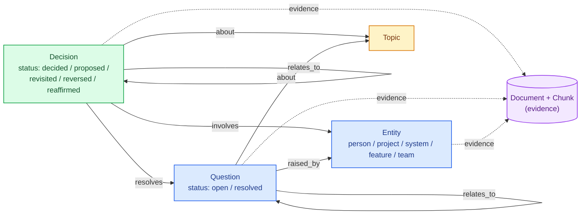
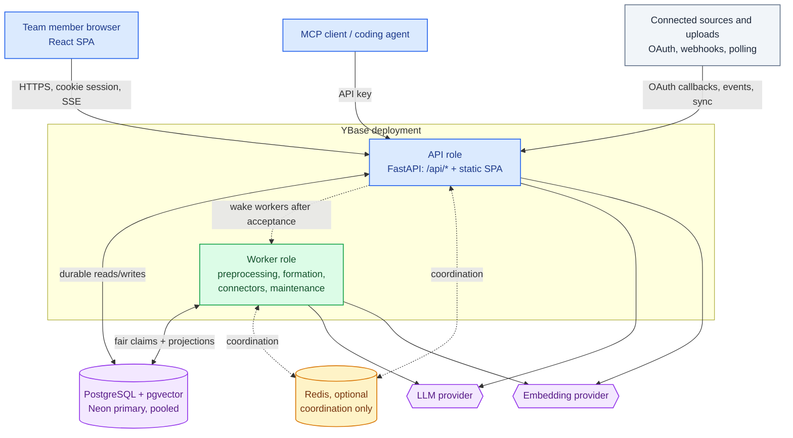
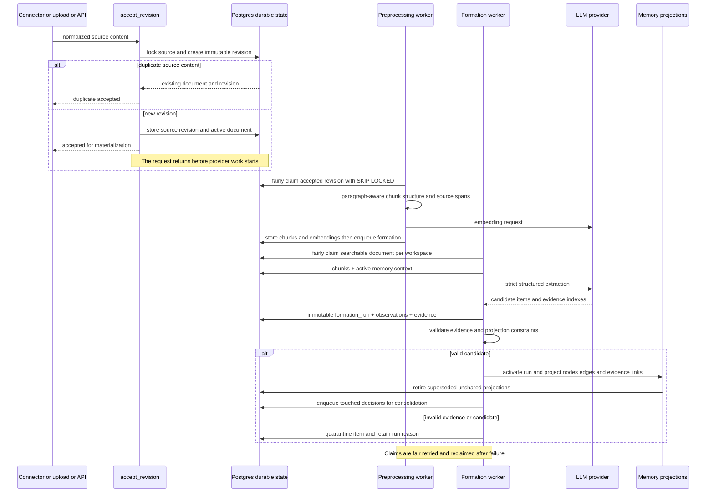
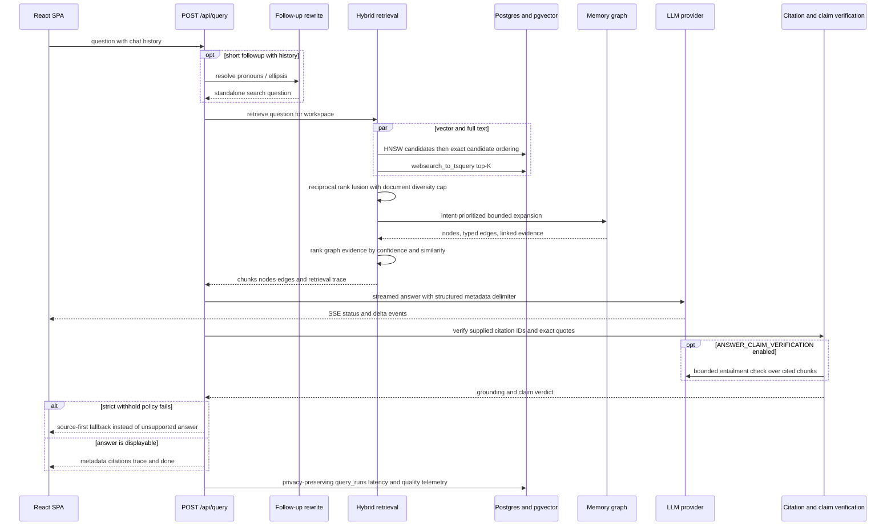
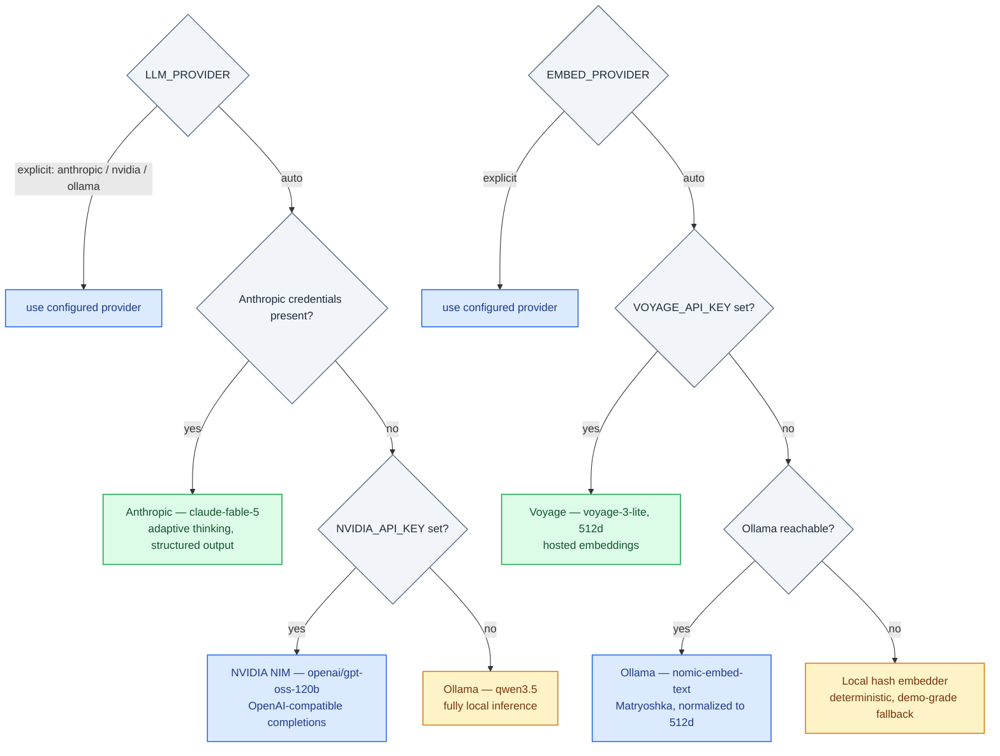
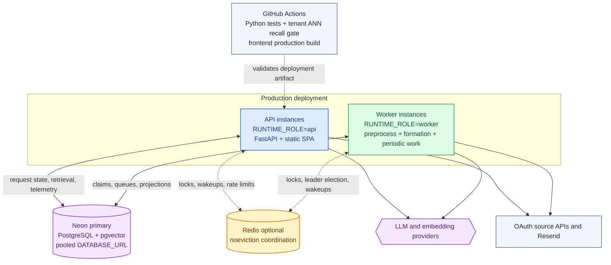

<div align="center">
  

  # YBase

  **The AI memory layer for teams that need to remember why.**

  YBase turns scattered conversations, tickets, documents, and code discussions
  into a connected, cited record of decisions.

  [](https://github.com/KarimMakhlas/YBase/actions/workflows/ci.yml)
  
  
  
  
  

  [Quick start](#quick-start) ·
  [Architecture](#architecture) ·
  [Data model](#data-model) ·
  [Configuration](#configuration) ·
  [Development](#development) ·
  [Deployment](#deployment) ·
  [All diagrams](docs/architecture.html)
</div>

---

## Why YBase?

Company knowledge is easy to find and hard to understand. Search can retrieve a
message or ticket, but it rarely reconstructs the full story:

> Why did we choose Postgres? Who argued for it? What alternatives were rejected?
> Was that decision revisited later?

YBase preserves that story. It extracts decisions, reasoning, people, topics,
questions, and evidence; connects them over time; and answers with citations
back to the original source material.

| Traditional knowledge search | YBase |
|---|---|
| Finds matching words | Reconstructs decisions and reasoning |
| Returns isolated documents | Expands through a typed memory graph |
| Treats every result equally | Ranks by relevance, status, recency, and evidence |
| Loses follow-up context | Carries conversation history across questions |
| Produces opaque answers | Streams cited answers with confidence and provenance |

### The memory graph, visually



Four node kinds, connected by typed edges that carry meaning — a `revisits`
edge is why a question that matches an old Slack debate can also surface a
later Jira reversal, even when the two sources share almost no words in
common. Every node traces back to the document and chunk that produced it.

## Product at a glance

| | Capability | What it gives the team |
|---|---|---|
| 🧠 | **Decision memory** | Decisions, rationale, alternatives, advocates, status, and revisit history |
| 🔎 | **Hybrid retrieval** | pgvector similarity, PostgreSQL full-text search, reciprocal-rank fusion, and graph expansion |
| 🔗 | **Connected context** | Typed links between decisions, people, topics, questions, and source evidence |
| 💬 | **Cited conversations** | Streaming answers, follow-ups, timelines, confidence, and retrieval traces |
| 🔌 | **Source integrations** | Slack, GitHub, Jira, direct upload, and offline Slack export |
| 🛡️ | **Workspace controls** | Cookie sessions, roles, audit events, rate limits, encrypted connector tokens, and billing gates |
| 🧰 | **Operational tooling** | Queue health, retries, demo seeding, memory review, feedback triage, and quality evaluation |
| 🏠 | **Flexible inference** | Anthropic, NVIDIA NIM, or fully local Ollama; Voyage, Ollama, or local embeddings |

## Architecture

YBase is a PostgreSQL-first system. FastAPI exposes the API and can serve the
built React SPA; PostgreSQL + pgvector is the durable source of truth for
source history, work queues, vectors, memory projections, and operational
telemetry. There is no separate queue or graph database.

Local development uses `RUNTIME_ROLE=all`, which starts API and worker loops in
one process. Production should run separate `api` and `worker` processes:
public traffic reaches only API instances, while worker instances claim durable
work from Postgres. Redis is optional coordination for multi-instance worker
locks, wakeups, leader election, and shared rate limits; it is not the queue.



For the complete runtime, data-lineage, retrieval, and deployment diagrams,
see the [full architecture documentation](#full-architecture-documentation).

## Quick start

### Option A — full stack with Docker

This starts PostgreSQL, builds the React UI, and serves everything from FastAPI
at `http://localhost:8100`.

**Prerequisites:** Docker and [Ollama](https://ollama.com) running on the host.

```bash
git clone https://github.com/KarimMakhlas/YBase.git
cd YBase

ollama pull qwen3.5
ollama pull nomic-embed-text

docker compose --profile app up -d --build
curl http://localhost:8100/api/health
```

Open **http://localhost:8100**. On a fresh database, the public landing page
guides the first owner through account and workspace setup.

Stop the stack with:

```bash
docker compose --profile app down
```

### Option B — local development

**Prerequisites:** Python 3.11+, Node.js 20+, Docker, and either Ollama or a
configured hosted LLM provider.

```bash
git clone https://github.com/KarimMakhlas/YBase.git
cd YBase

# 1. Local PostgreSQL + pgvector
docker compose up -d db

# 2. Backend
cp backend/.env.example backend/.env
cd backend
python3 -m venv .venv
.venv/bin/pip install -r requirements-dev.txt
.venv/bin/uvicorn app.main:app --reload --port 8100
```

In a second terminal:

```bash
cd YBase/frontend
npm ci
npm run dev
```

| Service | URL |
|---|---|
| Web application | http://localhost:5173 |
| Backend health | http://localhost:8100/api/health |
| Interactive API docs | http://localhost:8100/docs |
| PostgreSQL | `localhost:5433` |

To use an existing Neon database, put its pooled `DATABASE_URL` in
`backend/.env` and skip the local database command. See
[DEPLOY-neon.md](DEPLOY-neon.md) for production guidance.

## How the memory engine works

### Formation

1. A stable connector object or upload idempotency key accepts an immutable
   content revision before any embedding provider call. Provider creation and
   modification timestamps and the text-normalizer version are retained on the
   source object and revision.
2. A retry of the same source/content returns the existing revision; a changed
   connector object creates a new active revision and retains the old one as
   history outside retrieval.
3. Active revisions are split into evidence-sized chunks and embedded. Every
   chunk retains its source offset, paragraph path, content type, and estimated
   token count, so retrieved evidence can be traced to the original revision.
4. A bounded worker queue processes documents sequentially per workspace while
   allowing different workspaces to run in parallel.
5. The selected LLM extracts decisions, reasoning, alternatives, people,
   topics, open questions, and conflicts.
6. The extraction is saved as an immutable candidate run with one observation
   per proposed memory item. Missing or invalid evidence quarantines that item:
   no fallback chunk is fabricated and it never reaches the graph.
7. Only after validation and projection succeed does the candidate atomically
   become the active run for that document revision; the predecessor's
   unshared nodes, links, and edges are retired. Document detail exposes this
   active-run lineage and quarantine count.
8. Active observations project memory nodes to evidence chunks and to one
   another through typed graph edges.

Provider failure does not discard accepted content: the revision remains in a
reviewable failed state. When a connector reports deletion or permission loss,
its source object is explicitly deactivated rather than silently disappearing.
9. Near-duplicate decisions are consolidated by embedding similarity.



### Retrieval

1. Short follow-ups are rewritten into standalone questions.
2. Vector candidates are directly filtered by workspace and embedding model,
   over-fetched from HNSW, exact-ordered, then fused with PostgreSQL full-text
   results using reciprocal-rank fusion. pgvector iterative scans are used when
   the installed extension supports them.
3. Relevant memory nodes expand through the graph for up to two hops.
4. Evidence is ranked by relevance and memory confidence.
5. The LLM reasons over the evidence, graph context, and conversation history.
6. The API streams answer tokens and structured metadata over SSE.



## Configuration

YBase reads `backend/.env` at startup. Real environment variables take
precedence, and secrets should never be committed.

### LLM providers

Set `LLM_PROVIDER` to `auto`, `anthropic`, `nvidia`, or `ollama`.

| Provider | Activates when `auto` | Default model | Notes |
|---|---|---|---|
| Anthropic | Anthropic credentials are available | `claude-fable-5` | Streaming, adaptive thinking, structured extraction |
| NVIDIA NIM | `NVIDIA_API_KEY` is set | `openai/gpt-oss-120b` | OpenAI-compatible chat completions |
| Ollama | Fallback | `qwen3.5` | Fully local inference |

### Embedding providers

Set `EMBED_PROVIDER` to `auto`, `voyage`, `ollama`, or `local`.

| Provider | Activates when `auto` | Model | Notes |
|---|---|---|---|
| Voyage AI | `VOYAGE_API_KEY` is set | `voyage-3-lite` | Hosted 512-dimensional embeddings |
| Ollama | Ollama is reachable | `nomic-embed-text` | Local Matryoshka embeddings, normalized to 512 dimensions |
| Local hash | Fallback | `local-hash` | Deterministic, lexical, demo-grade fallback |

Embedding spaces must not be mixed. After changing providers or embedding
models, stage a workspace-local vector version, then atomically activate it
only after coverage completes:

```bash
backend/.venv/bin/python scripts/reembed.py --workspace default --activate

# Fast rollback: changes only the active model pointer; it does not re-embed.
backend/.venv/bin/python scripts/reembed.py --workspace default \
  --rollback-to voyage:voyage-3-lite:512
```

`GET /api/health/details` exposes the active model plus chunk and active
decision coverage. Do not activate a candidate with incomplete coverage: both
retrieval vectors and consolidation signatures must be staged together.

### Provider routing

Both `auto` chains prefer a hosted provider when credentials are present and
degrade gracefully to fully local inference otherwise:



### Important environment variables

| Variable | Purpose | Default |
|---|---|---|
| `DATABASE_URL` | PostgreSQL connection string | Local Compose database |
| `LLM_PROVIDER` | `auto`, `anthropic`, `nvidia`, or `ollama` | `auto` |
| `EMBED_PROVIDER` | `auto`, `voyage`, `ollama`, or `local` | `auto` |
| `CONNECTOR_SECRET_KEY` | Encrypts OAuth tokens at rest | Required for connectors |
| `ALLOW_PUBLIC_SIGNUP` | Enables public workspace registration | `true` |
| `SEED_DEMO_ON_SIGNUP` | Seeds new workspaces with demo memory | `true` |
| `SESSION_COOKIE_SECURE` | Sends session cookies over HTTPS only | `false` |
| `CORS_ORIGINS` | Allowed browser origins | Local Vite origins |
| `DB_POOL_MAX_SIZE` | Per-process database connection limit | `20` |
| `RUNTIME_ROLE` | `api`, `worker`, or combined local `all` process | `all` |
| `FORMATION_CONCURRENCY` | Parallel workspace formation workers | Auto |
| `INTEGRATION_CONCURRENCY` | Connector/digest periodic workers | `1` |
| `MAINTENANCE_CONCURRENCY` | Consolidation/janitor periodic workers | `1` |
| `RETRIEVAL_CANDIDATE_MULTIPLIER` | Wider union before final retrieval ranking | `3` |
| `ANSWER_CLAIM_VERIFICATION` | Enables the independent cited-evidence claim check | Production `true` |
| `ANSWER_CLAIM_FAILURE_POLICY` | `withhold` replaces failed claims with a source-first fallback; `report` streams and records the result | Production `withhold`, development `report` |
| `SENTRY_DSN` | Enables Sentry error reporting | Disabled |

See [backend/.env.example](backend/.env.example) for the full configuration surface.

## Integrations

YBase currently supports:

- **Slack** — OAuth, public-channel selection, Events API ingestion, periodic
  reconciliation, and historical backfill.
- **GitHub** — OAuth, repository selection, issue ingestion, and periodic
  resynchronization.
- **Jira** — Atlassian OAuth 3LO, project selection, issue ingestion, and
  periodic resynchronization.
- **Direct documents** — paste or upload content through the UI or API.
- **Slack exports** — import an unzipped workspace export without OAuth.

Connector credentials are encrypted using `CONNECTOR_SECRET_KEY`. Source-level
ACLs, private Slack channels, DMs, files, and attachments are intentionally
outside the current product boundary.

Slack has a live path on top of periodic reconciliation. The remaining
connectors are scheduled through durable sync jobs and selected streams. Every
source converges on the same immutable-revision and materialization path:

```mermaid
flowchart TB
  subgraph SlackFlow["Slack"]
    S1["OAuth install<br/>oauth.v2.access"]:::blue
    S2["Events API webhook<br/>live messages, HMAC verified"]:::green
    S3["Quiet-thread rollup<br/>SLACK_THREAD_QUIET_S"]:::green
    S4["Periodic reconcile<br/>SLACK_RECONCILE_INTERVAL_S<br/>(covers missed webhook deliveries)"]:::amber
    S1 --> S2 --> S3
    S1 --> S4
  end
  subgraph Polling["Scheduled connectors"]
    P1["OAuth connection<br/>encrypted tokens"]:::blue
    P2["Discover and select streams"]:::blue
    P3["Initial backfill and durable sync jobs"]:::amber
    P4["Periodic resync"]:::amber
    P5["GitHub · Jira · Linear · Confluence<br/>Discord · Google Docs · Notion · Figma"]:::gray
    P1 --> P2 --> P3 --> P4 --> P5
  end
  Accept["accept_revision()<br/>source object + immutable revision"]:::purple
  Preprocess["Durable materialization<br/>then formation"]:::purple

  S3 --> Accept
  S4 --> Accept
  P5 --> Accept
  Accept --> Preprocess

  classDef blue   fill:#dbeafe,stroke:#2563eb,color:#1e3a8a,stroke-width:1.4px;
  classDef green  fill:#dcfce7,stroke:#16a34a,color:#14532d,stroke-width:1.4px;
  classDef amber  fill:#fef3c7,stroke:#d97706,color:#78350f,stroke-width:1.4px;
  classDef purple fill:#f3e8ff,stroke:#9333ea,color:#581c87,stroke-width:1.4px;
  classDef gray   fill:#f1f5f9,stroke:#64748b,color:#1e293b,stroke-width:1.4px;
```



## Product surfaces

| Surface | Purpose |
|---|---|
| **Home** | Activity, recent decisions, open questions, digests, and relitigation alerts |
| **Ask memory** | Cited streaming chat with follow-ups, confidence, timelines, and retrieval traces |
| **Timeline** | Chronological documents, decisions, questions, and revisits |
| **Decision log** | Rationale, alternatives, participants, status, evidence, and lineage |
| **People** | Decisions, positions, questions, and documents connected to each person |
| **Graph** | Interactive exploration of the typed memory graph |
| **Sources** | OAuth connections, stream selection, backfills, and sync status |
| **Review** | Admin curation, editing, validation, archive, and restore |
| **Feedback** | Trust and answer-quality triage |
| **Ops** | Readiness checks, queue health, retries, recovery, and demo seeding |
| **Settings** | Workspace members, roles, account, and billing |

## API

FastAPI publishes the complete interactive contract at `/docs`. The main route
groups are:

| Route group | Responsibility |
|---|---|
| `/api/auth/*` | Bootstrap, registration, login, OAuth, sessions, and password reset |
| `/api/workspace/*` | Workspace setup, members, invites, roles, and ownership |
| `/api/sources/*` | Connector OAuth, streams, sync jobs, retries, and removal |
| `/api/ingest`, `/api/documents/*` | Ingestion, document status, reform, and relinking |
| `/api/query` | SSE answer stream with status, deltas, metadata, and completion |
| `/api/decisions`, `/api/timeline`, `/api/graph` | Read models over organizational memory |
| `/api/memory-review/*` | Admin review and curation |
| `/api/answer-feedback/*` | Member feedback and admin resolution |
| `/api/analytics/*` | Activation, engagement, and memory-quality metrics |
| `/api/ops/*` | Readiness, recovery, queue inspection, and demo operations |
| `/api/health*` | Database, provider, embedding, and queue health |

## Data model

`workspace_id` scopes nearly every durable product table for multi-tenancy.
The current model preserves an immutable source and extraction history, then
projects only the active revision and active formation into retrieval. The
typed graph (`memory_nodes`, `memory_edges`, `chunk_links`) is therefore a
derived, evidence-linked read model—not the only record of what an LLM
produced.

```mermaid
erDiagram
  workspaces ||--o{ workspace_memberships : has
  users ||--o{ workspace_memberships : has
  workspaces ||--o{ auth_sessions : scopes
  users ||--o{ auth_sessions : has
  workspaces ||--o{ workspace_invites : issues
  workspaces ||--o{ source_objects : owns
  source_objects ||--o{ document_revisions : versions
  document_revisions ||--|| documents : "active retrieval projection"
  documents ||--o{ chunks : "splits into"
  chunks ||--o{ chunk_embeddings : "versioned vector"
  embedding_models ||--o{ chunk_embeddings : defines
  document_revisions ||--o{ formation_runs : extracted_by
  formation_runs ||--o{ memory_observations : proposes
  memory_observations ||--o{ observation_evidence : supported_by
  chunks ||--o{ observation_evidence : supports
  memory_observations ||--o{ observation_projections : projects
  chunks ||--o{ chunk_links : evidences
  memory_nodes ||--o{ chunk_links : "evidenced by"
  workspaces ||--o{ memory_nodes : owns
  memory_nodes ||--o{ memory_node_embeddings : "versioned signature"
  embedding_models ||--o{ memory_node_embeddings : defines
  memory_nodes ||--o{ memory_edges : src
  memory_nodes ||--o{ memory_edges : dst
  memory_nodes ||--o{ decision_shares : "shared as"
  workspaces ||--o{ source_connections : has
  source_connections ||--o{ source_streams : has
  source_connections ||--o{ sync_jobs : has
  source_connections ||--o{ slack_events : buffers
  workspaces ||--o{ chat_sessions : has
  users ||--o{ chat_sessions : owns
  chat_sessions ||--o{ chat_messages : has
  chat_messages ||--o{ answer_feedback : receives
  workspaces ||--o{ feedback_regression_cases : "quality cases"
  workspaces ||--o{ query_runs : "privacy-safe telemetry"
  workspaces ||--o{ digests : generates
  workspaces ||--o{ audit_events : logs

  workspaces {
    int id PK
    text slug UK
    text plan
    text plan_status
    timestamptz trial_ends_at
  }
  users {
    int id PK
    text email UK
    text password_hash
    text auth_provider
    text google_sub UK
  }
  workspace_memberships {
    int workspace_id FK
    int user_id FK
    text role
  }
  auth_sessions {
    int id PK
    int user_id FK
    text token_hash UK
    timestamptz expires_at
    timestamptz revoked_at
  }
  source_objects {
    int id PK
    int workspace_id FK
    text identity_key UK
    int current_revision_id FK
    text status
  }
  document_revisions {
    int id PK
    int source_object_id FK
    int revision_number
    text content_hash
    text status
    text normalizer_version
  }
  documents {
    int id PK
    int workspace_id FK
    text source
    text content_hash
    text formation_status
    int formation_attempts
    text external_ref
  }
  chunks {
    int id PK
    int document_id FK
    int chunk_index
    vector embedding
    text embed_model
    tsvector text_tsv
  }
  embedding_models {
    int id PK
    text model_key UK
    int dimension
  }
  chunk_embeddings {
    int chunk_id FK
    int embedding_model_id FK
    vector embedding
  }
  formation_runs {
    bigint id PK
    int revision_id FK
    boolean is_active
    jsonb stage_timings
  }
  memory_observations {
    bigint id PK
    bigint formation_run_id FK
    int revision_id FK
    text kind
    text status
    jsonb payload
  }
  observation_evidence {
    bigint observation_id FK
    int chunk_id FK
  }
  observation_projections {
    bigint observation_id FK
    int node_id FK
  }
  memory_nodes {
    int id PK
    int workspace_id FK
    text kind
    text label
    text status
    jsonb data
    vector embedding
    timestamptz archived_at
  }
  memory_node_embeddings {
    int node_id FK
    int embedding_model_id FK
    vector embedding
  }
  memory_edges {
    int id PK
    int workspace_id FK
    int src FK
    int dst FK
    text relation
  }
  chunk_links {
    int chunk_id FK
    int node_id FK
    text relation
  }
  source_connections {
    int id PK
    text provider
    text access_token_enc
    text refresh_token_enc
    timestamptz last_sync_at
  }
  source_streams {
    int id PK
    int connection_id FK
    text external_id
    boolean selected
    jsonb sync_cursor
  }
  sync_jobs {
    int id PK
    int connection_id FK
    text status
    text kind
    jsonb stats
  }
  slack_events {
    int id PK
    text channel
    text thread_key
    boolean consumed
  }
  chat_sessions {
    int id PK
    int user_id FK
    text title
  }
  chat_messages {
    int id PK
    int session_id FK
    text role
    jsonb meta
  }
  answer_feedback {
    int id PK
    int chat_message_id FK
    text issue_type
    text status
  }
  feedback_regression_cases {
    int id PK
    int workspace_id FK
    text status
  }
  query_runs {
    bigint id PK
    int workspace_id FK
    int retrieval_ms
    int first_visible_ms
    text claim_verification_status
  }
  decision_shares {
    int id PK
    int node_id FK
    text token UK
    int view_count
  }
  digests {
    int id PK
    timestamptz period_start
    jsonb payload
  }
  workspace_invites {
    int id PK
    text token_hash UK
    text role
    timestamptz expires_at
  }
  audit_events {
    int id PK
    text action
    text target_type
    jsonb data
  }
```



Full schema in [schema.sql](backend/app/core/schema.sql) plus numbered
migrations in [backend/app/core/migrations/](backend/app/core/migrations/).

## Project structure

```text
YBase/
├── backend/
│   ├── app/
│   │   ├── api/                 # Router assembly and route compatibility aliases
│   │   ├── core/                # Config, DB, migrations, crypto, mail, observability
│   │   ├── domains/             # Product capabilities grouped by domain
│   │   │   ├── auth/
│   │   │   ├── connectors/
│   │   │   ├── documents/
│   │   │   ├── memory/
│   │   │   ├── query/
│   │   │   └── ...
│   │   ├── providers/           # LLM and embedding adapters
│   │   └── main.py              # FastAPI lifecycle and application assembly
│   ├── tests/                   # Pure, API, connector, graph, and worker tests
│   └── requirements*.txt
├── frontend/
│   ├── public/                  # Static brand assets
│   └── src/                     # React application, views, components, design system
├── scripts/                     # Demo, imports, evaluations, and re-embedding
├── docker-compose.yml           # Local pgvector and optional full-stack profile
├── Dockerfile                   # Multi-stage UI + API production image
└── fly.toml                     # Fly.io deployment configuration
```

## Development

### Backend tests

The test suite expects a PostgreSQL server with pgvector on port `5433`.

```bash
docker compose up -d db
cd backend
.venv/bin/pip install -r requirements-dev.txt
PYTHONPATH=. .venv/bin/python -m pytest
```

### Frontend build

```bash
cd frontend
npm ci
npm run build
```

### Memory-quality evaluation

Run the evaluator after changing formation prompts, models, retrieval, scoring,
or consolidation:

```bash
backend/.venv/bin/python scripts/eval.py
```

### Retrieval recall evaluation

Before rolling out a pgvector index, filter, or candidate-budget change, check
ANN quality against exact tenant-scoped search on a representative workspace:

```bash
backend/.venv/bin/python scripts/eval_retrieval.py \
  --workspace default --queries 50 --k 10 --min-recall 0.95
```

The command exits with status 1 when mean recall@10 is below the threshold and
status 2 when the workspace has too few chunks to measure it. Keep the rollout
gate at 95% mean recall@10 unless a product-specific evaluation justifies a
different threshold.

The GitHub Actions workflow runs the backend suite against pgvector/PostgreSQL,
then creates a disposable tenant corpus and blocks the build if tenant-scoped
ANN recall falls below 95%, before building the frontend on every push and pull
request. The deterministic CI corpus catches vector-index/filter/candidate
budget regressions; run the command above against a representative production
workspace before changing embeddings or search configuration.

### Retrieval scale profile

Before a Neon tier, pgvector-index, or candidate-budget rollout, run the
disposable 100k-chunk profile against a staging branch and keep the observed
p95 below the release budget:

```bash
DATABASE_URL='postgresql://…' backend/.venv/bin/python scripts/retrieval_load_profile.py \
  --chunks 100000 --queries 50 --max-p95-ms 100
```

The command uses fixed synthetic vectors to measure database/index latency
rather than an embedding provider. It creates a uniquely named workspace and
deletes it automatically; use `--keep-workspace` only when inspecting query
plans afterward.

To exercise the durable worker path across many tenants (acceptance → fair
claiming → concurrent chunking/embedding → formation handoff), run the separate
staging profile:

```bash
DATABASE_URL='postgresql://…' backend/.venv/bin/python scripts/worker_load_profile.py \
  --workspaces 20 --documents-per-workspace 5000 --concurrency 8 \
  --queries-per-workspace 10 --max-query-p95-ms 250
```

This profile uses the configured embedding provider, so it measures provider,
pool, and database contention together. It issues tenant-scoped ANN requests
while materialization is active, removes its generated workspaces by default,
and fails if the first service round is not workspace-fair, a query crosses a
tenant boundary, any revision is left unmaterialized, or query p95 exceeds its
budget.

`GET /api/ops/pipeline-slo` separates source-update-to-acceptance time from
acceptance-to-searchable and searchable-to-formed time. This makes connector
polling/freshness delays visible without conflating them with materialization
or formation backlog.

### Release budgets

For a model, prompt, index, embedding, ranking, or retrieval rollout, retain a
fixed staging-evaluation JSON artifact containing `ann_recall_at_10`,
`citation_entailment_precision`, `retrieval_p95_ms`,
`query_provider_cost_usd`, and `formation_queue_p95_ms`. Compare the candidate
to the accepted baseline:

```bash
python scripts/check_release_budget.py \
  --baseline evaluation/baseline.json --candidate evaluation/candidate.json
```

The gate requires at least 95% ANN recall@10, allows no more than a two-point
loss in retrieval recall or citation-entailment precision, and blocks more than
a 20% rise in retrieval p95, per-query provider cost, or formation queue p95.
The **Release evaluation** GitHub Actions workflow runs this same gate with the
two explicitly supplied artifact paths.

`GET /api/ops/query-slo` also reports `p95_first_visible_ms` separately from
completion time. This exposes the deliberate latency trade-off of strict claim
withholding and keeps user-perceived responsiveness visible during a rollout.

For model or prompt changes, record the passed canary and a concrete rollback
target, then provide it to the gate:

```json
{
  "candidate_sha256": "sha256 of candidate.json bytes",
  "canary": {"scope": "staging canary workspace", "result": "passed"},
  "rollback": {"strategy": "deploy previous prompt version", "target": "prompt:2026-08-01"}
}
```

```bash
python scripts/check_release_budget.py \
  --baseline evaluation/baseline.json --candidate evaluation/candidate.json \
  --change-kind prompt --rollout-metadata evaluation/prompt-rollout.json
```

An approved exception is never a reusable bypass: pass `--approval` only with
an artifact that includes the approver, reason, approval/expiry timestamps, and
SHA-256 hashes of the exact baseline and candidate files. The gate rejects an
expired or hash-mismatched approval and prints the accepted exception into CI
logs for audit.

Production uses `ANSWER_CLAIM_FAILURE_POLICY=withhold` by default: answer text
is held until structural citation and claim-entailment checks finish. If either
fails, users receive a transparent prompt to inspect the cited sources rather
than the unsupported generated text. Set `report` for a measured, lower-latency
observation rollout; the outcome remains in query telemetry and SSE metadata.

## Demo and data import

Authenticate as an owner or admin, then:

```bash
export YBASE_EMAIL=owner@example.com
export YBASE_PASSWORD='your-password'

# Seed documents and run representative questions
backend/.venv/bin/python scripts/demo.py

# Preview and import an offline Slack export
backend/.venv/bin/python scripts/import_slack.py /path/to/export \
  --channel engineering --since 2025-01-01 --limit 20 --dry-run
```

The in-product **Ops** surface can also seed a compact demo corpus and expose
formation or sync failures without using the CLI.

## Deployment

| Target | Path |
|---|---|
| Docker | `docker compose --profile app up -d --build` |
| Fly.io | [fly.toml](fly.toml) |
| Neon Postgres | [DEPLOY-neon.md](DEPLOY-neon.md) |

Production deployments should use HTTPS, set `SESSION_COOKIE_SECURE=true`,
restrict `CORS_ORIGINS`, configure a stable `CONNECTOR_SECRET_KEY`, and use a
pooled PostgreSQL connection string.



## Full architecture documentation

This README covers the highlights. [docs/architecture.html](docs/architecture.html)
is a self-contained documentation site — no server or internet connection
required, just clone the repo and open the file in a browser — with all of
the architecture diagrams in one place: system trust boundaries, runtime roles,
application modules, revision/materialization, reproducible formation lineage,
tenant-safe retrieval, answer verification, release gates, and production
topology. Light/dark themes, search, and one-click SVG/PNG export are included
for every diagram.

## Current boundaries

- The graph uses PostgreSQL adjacency tables; no separate graph database is
  required at the current scale.
- Access control is workspace-scoped, not per document or per source.
- Slack v1 focuses on selected public channels; private channels and DMs are not
  ingested.
- Local hash embeddings are for evaluation and demos, not production semantic
  retrieval.
- Formation quality and latency depend on the selected model and available
  hardware.

## License

Copyright © 2026 YBase. All rights reserved.

This repository is proprietary software. No license is granted for use,
copying, modification, or distribution without prior written permission.
